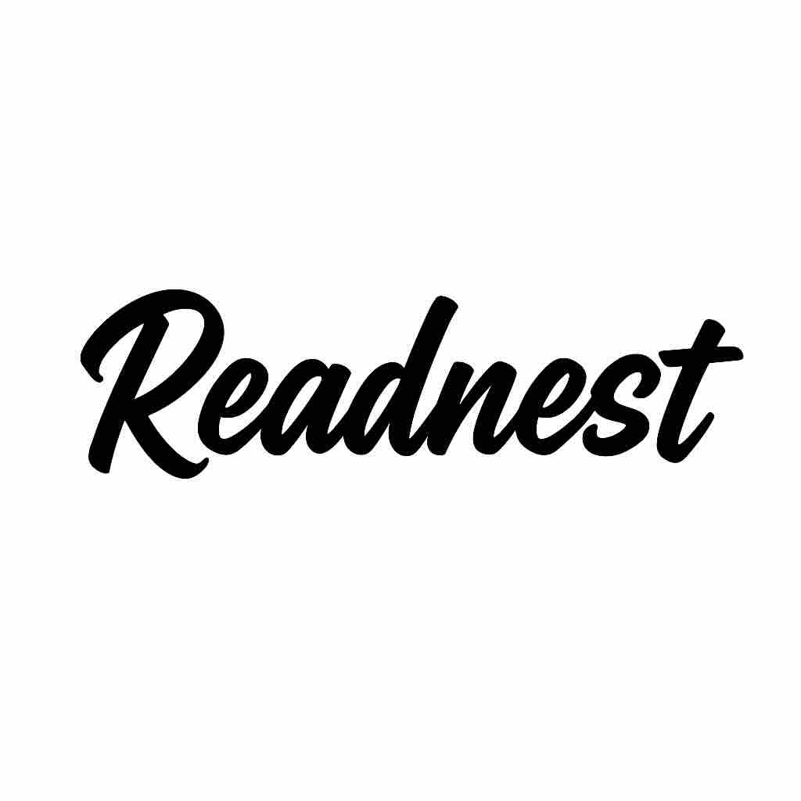

<p align="center">
  
</p>

<h1 align="center">Readnest</h1>

<p align="center">
  A nest for readers and writers, discover, share, and celebrate literature together.
</p>


# Readnest

Readnest is a community platform dedicated to literature, connecting readers, publishing houses, and bookshops through inspiring literary reviews, recommendations, and more.

## Features

- Publish and browse literary chronicles
- User profiles with avatar and bio
- Publishing house and bookshop partners
- Advanced search (users, chronicles, publishing houses, bookshops)
- Notifications (likes, comments, follows)
- Private messaging
- Bookshop geolocation on interactive map

## Installation

1. **Requirements**
   - Ruby 3.x
   - Rails 7.x
   - PostgreSQL
   - Node.js & Yarn

2. **Clone the project**
   ```sh
   git clone https://github.com/your-username/readnest.git
   cd readnest
   ```

3. **Install dependencies**
   ```sh
   bin/setup
   ```

4. **Setup the database**
   ```sh
   rails db:prepare
   ```

5. **Start the server**
   ```sh
   rails server
   ```

## Configuration

- Environment variables (e.g. Cloudinary, SendGrid) should be set in `.env`.
- For email delivery, configure your keys in `config/environments/production.rb`.

## Testing

To run the test suite:
```sh
rails test
```

## Deployment

Heroku

## Contributing

Contributions are welcome! Open an issue.

---

For any questions, contact the Readnest team : Aldjia Dev
